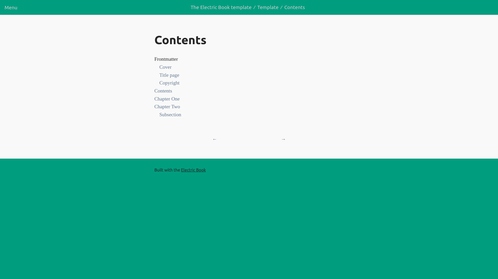

# Visual regression testing

Evaluates the visible output of this application and compares that output against the results expected by design. We use [jest-image-snapshot](https://github.com/americanexpress/jest-image-snapshot) for these tests.

## Example "before" snapshot images
__Images used as a baseline for visual regression testing.__

[See more](img/)

## Image diff example
__Video did not load.__

